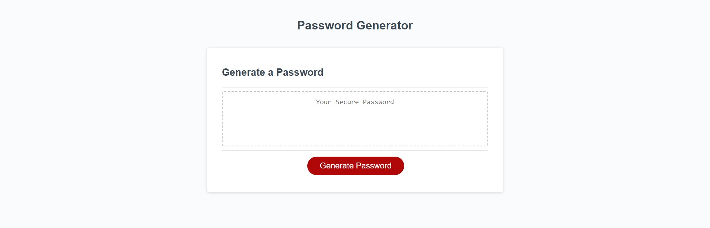

# Pasword Generator
## Description

The goal of this project was to develop a randomized password generator based of off 5 quick user prompts. We wanted to help people who needed to protect sensitive data come up with a strong password for greater security without any effort.
## Installation

N/A

## Usage

The password generator is easy to use: first the user clicks the red "Generate Password" button. The page will then provide a window prompt requesting an input for how many characters the user wnats or needs their password to be. The password generator is designed to produce a string of characters 8 to 128 characters long, and if user input falls out of range the page will alert them to the criteria and they must start the process over. The user will then be asked what types of characters do they want or need for their password, if they say no to the 4 presented character types the page will alert them that they need to select at least one to continue and will ask them to try again. Once all criteria have been met the password generator will create a randomized password utilizing a JavaScript function and will display the password in the text box.

## Credits

Thank you to my instrucotor Leif for teaching me the skills and concepts required to put this project together.

## License

Refer to the liscense in the GitHub repo.

## Links

Password Generator: https://xwhoknowz.github.io/Password-Generator/

## Website Sample

